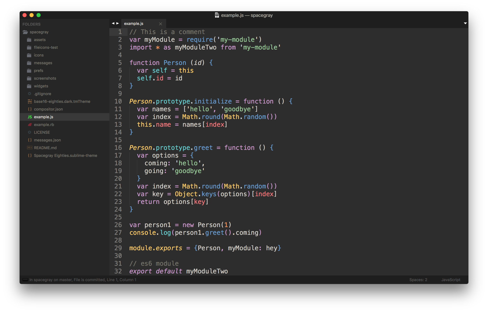

# Spacegray

A set of custom UI themes for Sublime Text 2/3. It's all about hype and minimal. Comes in different flavors with accompanying [Base16](https://github.com/chriskempson/base16) color schemes.

## What's in this fork?

Designed specifically for JavaScript and Stylus. It reduce the use of red in variable names and has more styling of reserved keywords, object literals, parenthesis, arguments and methods.

***

### Themes

#### Spacegray Eighties

A variation based on Base16 Eighties Dark color scheme.



*The font used in the screenshots is [__Source Code Pro__](https://github.com/adobe-fonts/source-code-pro).*

***

### How to Install

Follow these steps:

1. [Download the .zip](https://github.com/mhkeller/spacegray/archive/master.zip)
2. Unzip and rename the folder to `Theme - Spacegray`
3. Copy the folder into `Packages` directory, which you can find using the menu item `Sublime Text -> Preferences -> Browse Packages...`

***

### How to Activate

Activate the UI theme and color scheme by modifying your user preferences file, which you can find using the menu item `Sublime Text -> Preferences -> Settings - User` (<kbd>⌘</kbd><kbd>,</kbd> on Mac).

You can choose whichever flavor you like, but don't forget to change *both* color scheme and UI theme so they match.

***Note: Don't forget to restart Sublime Text after activating the theme.***

#### Settings for Spacegray Eighties

```json
{
  "theme": "Spacegray Eighties.sublime-theme",
  "color_scheme": "Packages/Theme - Spacegray/base16-eighties.dark.tmTheme",    "spacegray_fileicons": true
}
```

***

### Settings

#### Tab labels font size

Copy and paste one of four options in your user preferences file:

```json
  "spacegray_tabs_font_small": true
```
```json
  "spacegray_tabs_font_normal": true
```
```json
  "spacegray_tabs_font_large": true
```
```json
  "spacegray_tabs_font_xlarge": true
```

#### Tabs size

Tabs height:

```json
  "spacegray_tabs_small": true
```
```json
  "spacegray_tabs_normal": true
```
```json
  "spacegray_tabs_large": true
```
```json
  "spacegray_tabs_xlarge": true
```

Tabs width:

```json
  "spacegray_tabs_auto_width": true
```

#### Sidebar labels font size

```json
  "spacegray_sidebar_font_small": true
```
```json
  "spacegray_sidebar_font_normal": true
```
```json
  "spacegray_sidebar_font_large": true
```
```json
  "spacegray_sidebar_font_xlarge": true
```

#### Sidebar tree rows height

```json
  "spacegray_sidebar_tree_xsmall": true
```
```json
  "spacegray_sidebar_tree_small": true
```
```json
  "spacegray_sidebar_tree_normal": true
```
```json
  "spacegray_sidebar_tree_large": true
```
```json
  "spacegray_sidebar_tree_xlarge": true
```

#### Hide navigation icons in Sublime Text 3

```json
    "enable_tab_scrolling": false,
```

#### Enable sidebar fileicons (only works in Sublime Text 3)

```json
    "spacegray_fileicons": true,
```


#### Disable custom OSX Title Bar in Sublime Text 3

Useful if you're using native OSX tabs since the custom Title Bar breaks the native tabs

```json
    "disable_custom_title_bar": true,
```

***

### Thanks

The Spacegray Eighties variation is contributed by [Yoshua Wuyts](https://github.com/yoshuawuyts).
